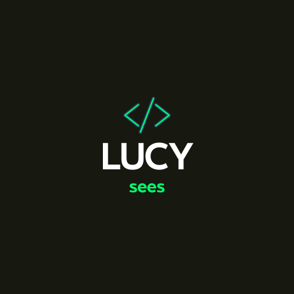

  
   

  <h3><b>Portfolio: setup and mobile first</b></h3>

# 📗 Table of Contents

- [📖 About the Project](#about-project)
  - [🛠 Built With](#built-with)
    - [Tech Stack](#tech-stack)
    - [Key Features](#key-features)
  - [🚀 Live Demo](#live-demo)
- [💻 Getting Started](#getting-started)
  - [Setup](#setup)
  - [Prerequisites](#prerequisites)
  - [Deployment](#deployment)
- [👥 Authors](#authors)
- [🤝 Contributing](#contributing)
- [⭐️ Show your support](#support)
- [🙏 Acknowledgements](#acknowledgements)
- [❓ FAQ (OPTIONAL)](#faq)
- [📝 License](#license)

# 📖 Webforlio 

**Webforlio** A captivating portfolio project powered by HTML and CSS showcasing the mobile-first approach of a portfolio project.

## 🛠 Built With 

### Tech Stack 

  
Client

  <ul>
    <li><a href="https://html.com/">HTML</a></li>
    <li><a href="https://www.css3.com/">CSS</a></li>
    <li></li>
  </ul>

### Key Features 

- Headline Section - Displays the homepage of the portfolio.

- **[Display headline section of the Portfolio: setup and mobile first.]**

(<a href="#readme-top">back to top</a>)

## 🚀 Live Demo 

- [Live Demo Link](https://lucy-sees.github.io/Webforlio/)

(<a href="#readme-top">back to top</a>)

## 💻 Getting Started 

To get a local copy up and running, follow these steps.

### Prerequisites

To run this project you need:
Install Git Bash, Web browser and code editor

### Setup

Clone this repository to your desired folder:
cd my-folder
git clone git@github.com:myaccount/https://github.com/lucy-sees/Webforlio.git

### Deployment

You can deploy this project using:
Web Browser

(<a href="#readme-top">back to top</a>)

## 👥 Authors 

👤 **Lucy W. Mwangi**

- GitHub: [@lucy-sees](https://github.com/lucy-sees)
- Twitter: [@\_The_LoneWolf](https://twitter.com/lucy_w_mwangi)
- LinkedIn: [LinkedIn](https://www.linkedin.com/in/lucy-wanjiru-mwangi)

(<a href="#readme-top">back to top</a>)

## 🤝 Contributing 

Contributions, issues, and feature requests are welcome!

Feel free to check the [issues page](https://lucy-sees.github.io/Webforlio/issues/).

(<a href="#readme-top">back to top</a>)

## ⭐️ Show your support 

If you like this project give it a star!!!

(<a href="#readme-top">back to top</a>)

## 📝 License 

This project is [MIT](https://github.com/lucy-sees/Webforlio/blob/d3ad7276290d3f8ca737ca792c92f18fed58845c/LICENSE) licensed.

(<a href="#readme-top">back to top</a>)

